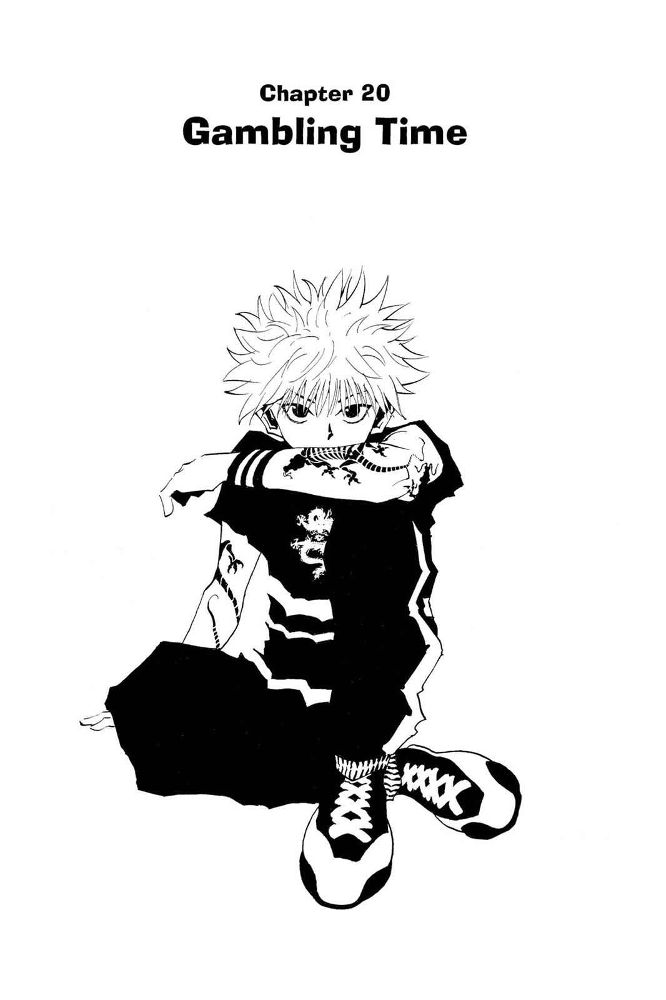

# Janken (Rock, Paper, Scissors)

A simple browser-based Rock, Paper, Scissors game built with vanilla HTML, CSS, and JavaScript — no frameworks, no build step. Play best-of-five against the computer.



## Play

Open `index.html` in a browser, click the front image to enter the game, then pick rock, paper, or scissors. First to win the majority of 5 rounds takes it. Click **Play Again** to reset.

## Built with

- HTML5
- CSS3 (Flexbox)
- JavaScript (ES Modules, no dependencies)

## Project structure

```
janken/
├── index.html
├── style.css
├── script.js
├── Media/       # game icons and images
└── README.md
```

## Running locally

No build tools or installs required. Clone the repo and open `index.html` directly in a browser:

```bash
git clone https://github.com/Mayn18/janken.git
cd janken
```

## About this project

This project was built as part of [The Odin Project](https://www.theodinproject.com/) curriculum — a free, open-source coding curriculum for learning full-stack web development.

## Links

- [GitHub](https://github.com/Mayn18)
- [YouTube](https://www.youtube.com/@MaynToWorld)
- [Twitch](https://www.twitch.tv/mayntoworld)

## Image credits

Some images used in this project are sourced from the *Hunter x Hunter* manga and are the property of their original creator, Yoshihiro Togashi, and its publishers. They are used here for non-commercial, educational purposes only as part of a learning project. No ownership is claimed over these images, and no infringement is intended. If you are a rights holder and would like an image removed, please open an issue or reach out via the links below.

## License

The code in this project is open source and available for anyone to reference or learn from. This license does not extend to the third-party images noted above.